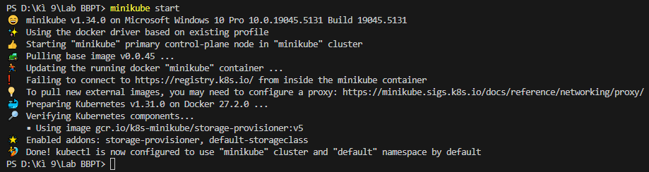
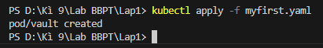
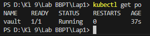
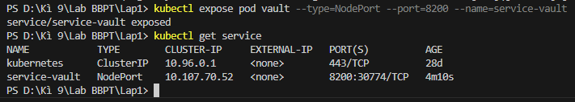
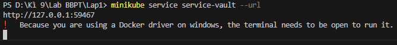
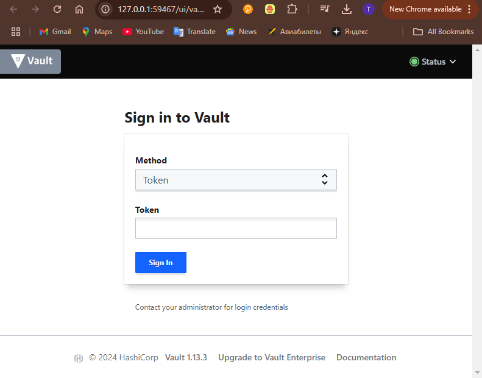
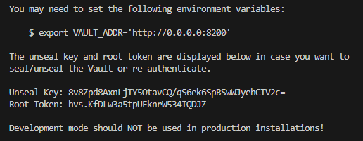
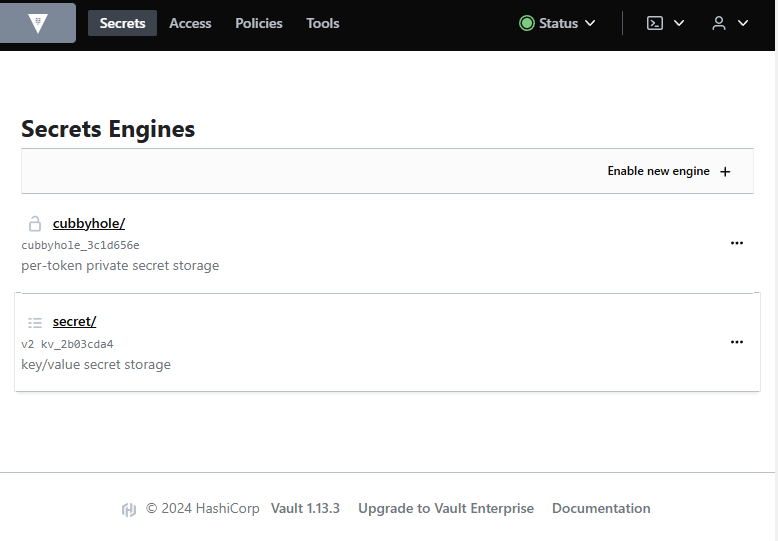
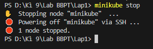
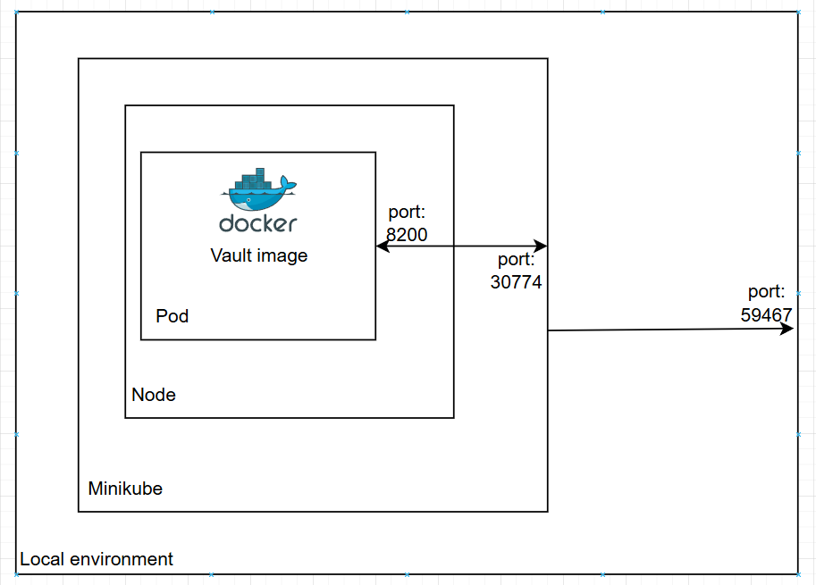

Университет: [Университет ИТМО](https://itmo.ru/ru/)
Факультет: [ФИКТ](https://fict.itmo.ru)
Курс: [Введение в распределенные технологии](https://github.com/itmo-ict-faculty/introduction-to-distributed-technologies)
Год: 2024/2025
Группа: K4110c
Автор: Буй Ань Туан
Лаборатория: Lab 1
#

## ЦЕЛЬ:
Ознакомиться с инструментами Minikube и Docker, развернуть свой первый "pod".
## ХОД РАБОТЫ:
### 1. Запустить демон Docker, запустив приложение Docker Desktop.
### 2. После установки Minikube разверните кластер Minikube с помощью команды
```
minikube start
```


### 3. Создайте развертывание с именем *vault*, используя образ Vault, версии 1.13.3
```
apiVersion: v1
kind: Pod
metadata:
  name: "vault"
  namespace: default
  labels:
    app: ""
spec:
  containers:
  - name: vault
    image: "vault:1.13.3"
    ports:
    - containerPort: 8200
```
Этот файл определяет имя и порт модуля, а также образ, используемый для создания контейнера.
После создания файла *yaml* выполните следующую команду для создания pod.
```
kubectl apply -f myfirst.yaml
```


### 4. Получите имя пода с помощью команды
```
kubectl get pod
```


После создания развертывания также создается pod.

### 5. Создайте службу для доступа к pod через порт 8200
```
kubectl expose pod vault --type=NodePort --port=8200 --name=service-vault
```


### 6. После этого используйте переадресацию портов, чтобы мы могли получить доступ к службе с нашей локальной машины
```
minikube service service-vault --urf
```


### 7. Доступ к сервису по ссылке *localhost:8200*


### 8. Чтобы найти учетные данные, используйте эту команду
```
kubectl logs vault
```
Учетные данные находятся в конце вывода.



### 9. Используйте учетные данные для аутентификации, затем мы перейдем к этому страница


### 11. Остановите кластер Minikube
```
minikube stop
```


## ДИАГРАММА
