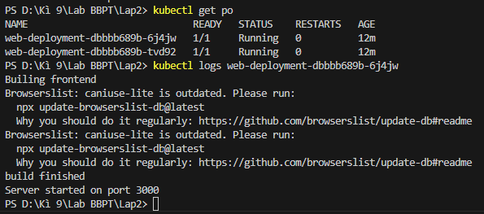

Университет: [Университет ИТМО](https://itmo.ru/ru/)
Факультет: [ФИКТ](https://fict.itmo.ru)
Курс: [Введение в распределенные технологии](https://github.com/itmo-ict-faculty/introduction-to-distributed-technologies)
Год: 2024/2025
Группа: K4110c
Автор: Буй Ань Туан
Лаборатория: Lab 2
#

## ЦЕЛЬ:
Ознакомиться с типами "контроллеров" развертывания контейнеров, ознакомится с сетевыми сервисами и развернуть свое веб приложение.
## ХОД РАБОТЫ:
### 1. Создайте развертывание с 2 репликами на основе образа *ifilyaninitmo/itdt-contained-frontend*.
Сначала создайте файл манифеста yaml
```
apiVersion: apps/v1
kind: Deployment
metadata:
  name: web-deployment
  labels:
    app: web
spec:
  replicas: 2
  selector:
    matchLabels:
      app: web
  template:
    metadata:
      labels:
        app: web
    spec:
      containers:
      - name: container-frontend
        image: ifilyaninitmo/itdt-contained-frontend:master
        env:
        - name: REACT_APP_USERNAME
          value: Bui_Tuan
        - name: REACT_APP_COMPANY_NAME
          value: ITMO
        ports:
        - containerPort: 3000
```
Этот файл передает переменные среды в наши 2 реплики.
После этого запустите эту команду, чтобы создать развертывание.
```
kubectl apply -f Lap2.yaml
```
### 2. Создайте службу для предоставления нашего развертывания внешнему трафику
```
kubectl expose deployment/web-deployment --type="NodePort" --port 3000
```


### 3. Запустите режим переадресации портов для доступа к нашим контейнерам через браузер
```
minikube service web-deployment
```


### 4. Доступ к веб-странице через браузер


2 переменные среды REACT_APP_USERNAME и REACT_APP_COMPANY_NAME всегда будут одинаковыми. Однако имя контейнера может меняться в зависимости от того, на какой модуль служба направляет трафик.
Чтобы проверить это, я удалил один из двух модулей и повторно выполнил команду переадресации портов. Имя контейнера на веб-странице было изменено на имя другого модуля.
### 5. Проверьте логи контейнеров, приложите логи
```
kubectl logs web-deployment-dbbbb689b-6j4jw
```


## ДИАГРАММА

