Университет: [Университет ИТМО](https://itmo.ru/ru/)

Факультет: [ФИКТ](https://fict.itmo.ru)

Курс: [Введение в распределенные технологии](https://github.com/itmo-ict-faculty/introduction-to-distributed-technologies)

Год: 2024/2025

Группа: K4110c

Автор: Буй Ань Туан

Лаборатория: Lab 3
#

## ЦЕЛЬ:
Ознакомиться с сертификатами и «секретами» в Minikube, безопасное хранение данных в Minikube.

## ХОД РАБОТЫ:
### 1. Создание карты конфигурации с 2 переменными REACT_APP_USERNAME и REACT_APP_COMPANY_NAME
```
kubectl create configmap myconfigmap --from-literal=REACT_APP_USERNAME=Bui-Tuan --from-literal=REACT_APP_COMPANY_NAME=ITMO
```
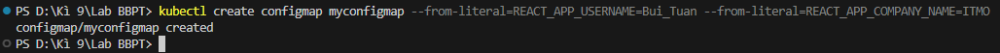

### 2. Создание развертывания с 2 реплики, использующие карту конфигурации для передачи переменных среды в модули
Создайте файл манифеста развертывания
```
apiVersion: apps/v1
kind: Deployment
metadata:
  name: web-app
spec:
  replicas: 2
  selector:
    matchLabels:
      app: web-app
  template:
    metadata:
      labels:
        app: web-app
    spec:
      containers:
      - name: web-app
        image: ifilyaninitmo/itdt-contained-frontend:master
        ports:
        - containerPort: 3000
        envFrom:
        - configMapRef:
            name: myconfigmap
```
Затем примените файл для создания развертывания
```
kubectl apply -f lap3.yaml
```
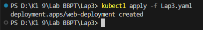

### 3. Предоставьте доступ к нашему приложению с помощью Service
```
kubectl expose deployment web-deployment --type=NodePort --port=3000
```
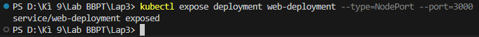

### 4. Установите Ingress Controller в Minikube
```
minikube addons enable ingress
```


### 5. Сгенерируйте самоподписанный сертификат и импортируйте его в наш кластер Kubernetes
Сгенерируйте самоподписанный сертификат
```
openssl req -new -newkey rsa:4096 -x509 -sha256 -days 365 -nodes -out MyCertificate.crt -keyout MyKey.key
```
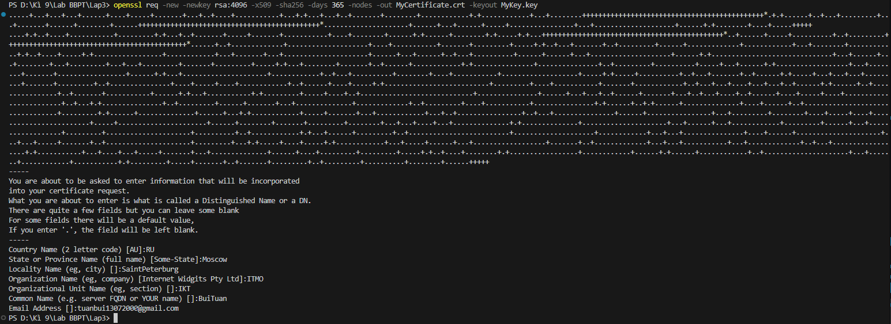

Импортируем сертификат в наш кластер, создав секрет с именем *my-certificate*
```
kubectl create secret tls my-certificate --key MyKey.key --cert MyCertificate.crt -n reactapp
```
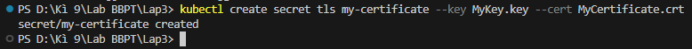

### 6. Создайте ingress с импортированным сертификатом
Создайте файл манифеста для ingress *ingress.yaml*
```
apiVersion: networking.k8s.io/v1
kind: Ingress
metadata:
  name: web-ingress
spec:
  tls:
  - hosts:
      - edu.info
    secretName: my-certificate
  rules:
  - host: edu.info
    http:
      paths:
      - path: /
        pathType: Prefix
        backend:
          service:
            name: web-service
            port:
              number: 3000
```
Затем примените его
```
kubectl apply -f ingress.yaml
```
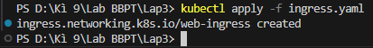

### 7. Отредактируйте файл hosts, включив в него наше имя хоста edu.info, и запустите туннель Minikube
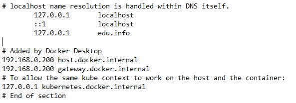

```
minikube tunnel
```
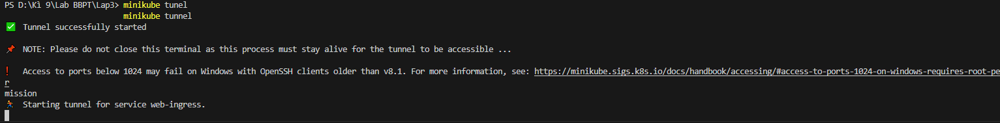

### 8. Доступ к приложению через браузер с использованием имени хоста edu.info
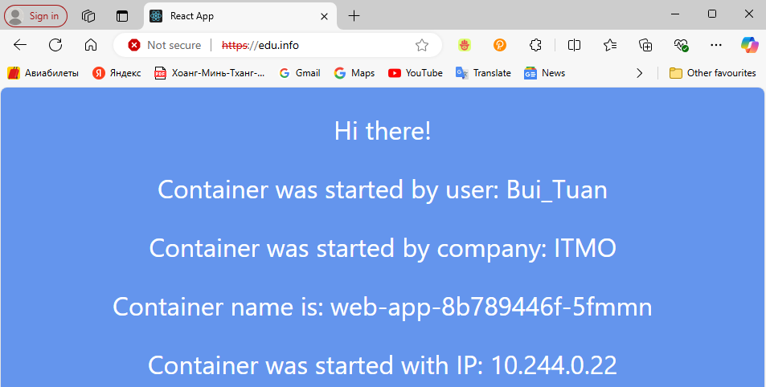

Просмотреть самоподписанный сертификат

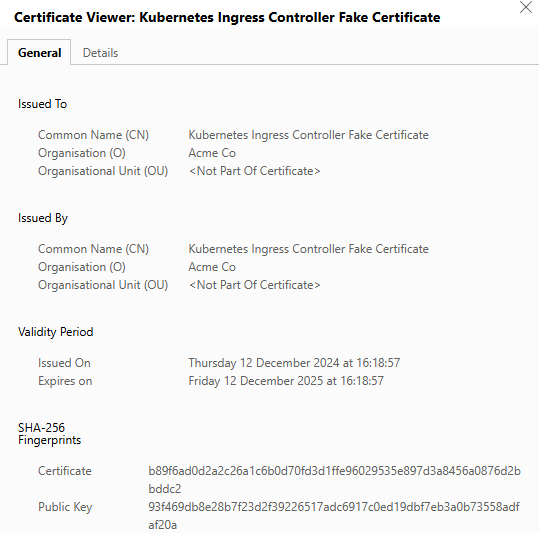

## ДИАГРАММА
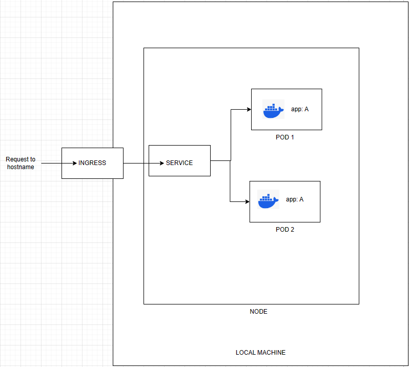
