Университет: [Университет ИТМО](https://itmo.ru/ru/)
Факультет: [ФИКТ](https://fict.itmo.ru)
Курс: [Введение в распределенные технологии](https://github.com/itmo-ict-faculty/introduction-to-distributed-technologies)
Год: 2024/2025
Группа: K4110c
Автор: Буй Ань Туан
Лаборатория: Lab 4
#

## ЦЕЛЬ:
Ознакомиться с CNI Calico и функцией IPAM Plugin, изучить возможности CNI и CoreDNS.
## ХОД РАБОТЫ:
### 1. Запуск кластера из 2 узлов с установкой CNI Calico
```
minikube start --network-plugin=cni --cni=calico --nodes 2 -p multinode
```
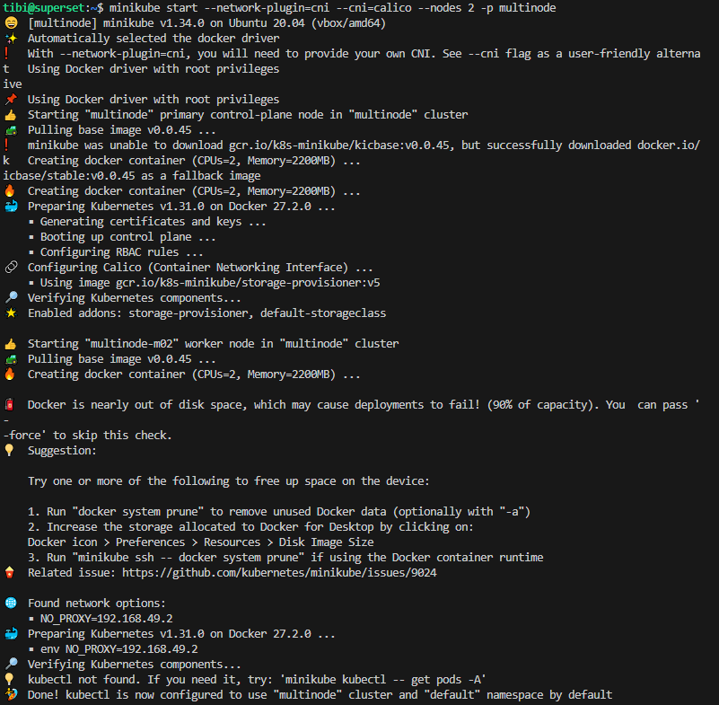

Получить список узлов
```
kubectl get nodes
```
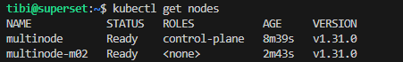

Проверка установки Calico в кластере
```
kubectl get pods -l k8s-app=calico-node -A
```
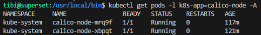

### 2. Пометьте узлы
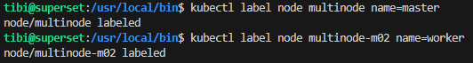

### 3. Напишите файл манифеста для назначения пула IP-адресов узлам на основе их меток.
```
apiVersion: projectcalico.org/v3
kind: IPPool
metadata:
  name: master-ippool
spec:
  cidr: 192.168.0.0/24
  ipipMode: Always
  natOutgoing: true
  nodeSelector: name == "master"
---
apiVersion: projectcalico.org/v3
kind: IPPool
metadata:
  name: worker-ippool
spec:
  cidr: 192.168.1.0/24
  ipipMode: Always
  natOutgoing: true
  nodeSelector: name == "worker"
```
Примените файл
```
calicoctl apply -f ippool.yaml --allow-version-mismatch
```
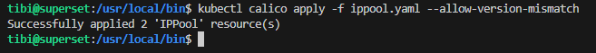

Теперь у нас должно быть два включенных пула IP, которые мы можем увидеть при запуске
```
calicoctl get ippool -o wide --allow-version-mismatch
```
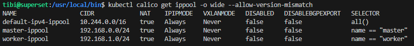

### 4. Развертывание приложения и его раскрытие с помощью сервиса
Создание configmap
```
kubectl create configmap myconfigmap --from-literal=REACT_APP_USERNAME=Bui-Tuan --from-literal=REACT_APP_COMPANY_NAME=ITMO
```
Развертывание приложения с помощью файла deployment.yaml
```
kubectl apply -f deploy.yaml file
```
Раскрытие приложение
```
kubectl expose deployment web-deployment --type=NodePort --port=3000
```
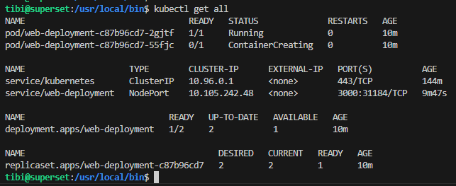

### 5. Включить переадресацию портов
```
minikube service -p multinode web-deployment --url
```
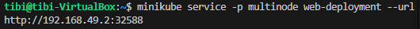

### 6. Доступ к приложению через браузер
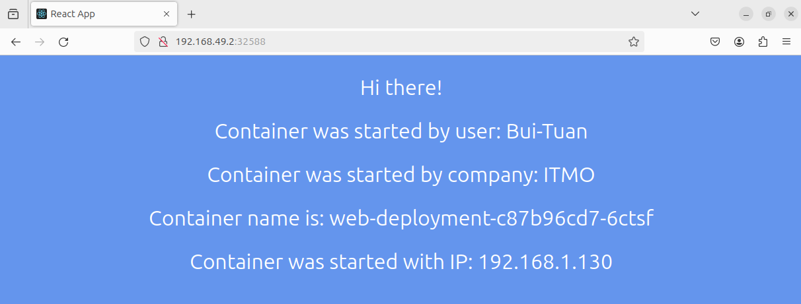

Имя контейнера и IP-адрес контейнера не изменится даже при многократной перезагрузке страницы. Чтобы объяснить это, давайте получим IP-адрес наших модулей
```
kubectl get pods -o wide
```
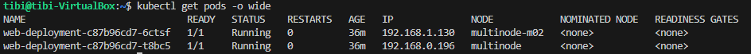

Как мы видим, один модуль развернут на главном узле с пулом IP 192.168.0.0/24, а другой модуль развернут на рабочем узле с пулом IP 192.168.1.0/24
Сервис направляет наш запрос только на рабочий узел, поэтому поля имени контейнера и IP-адреса контейнера не меняются.

### 7. Подключитесь к одному из модулей и отправьте ping на другой
Подключитесь к модулю в главном узле и отправьте ping на модуль в рабочем узле
```
kubectl exec -it web-deployment-c87b96cd7-t8bc5 -- ping 192.168.1.130
```
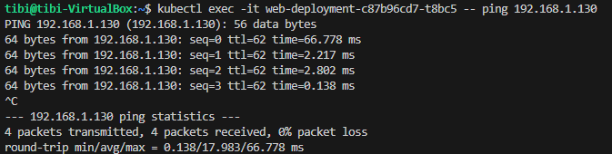

Ping команд работает.

## ДИАГРАММА
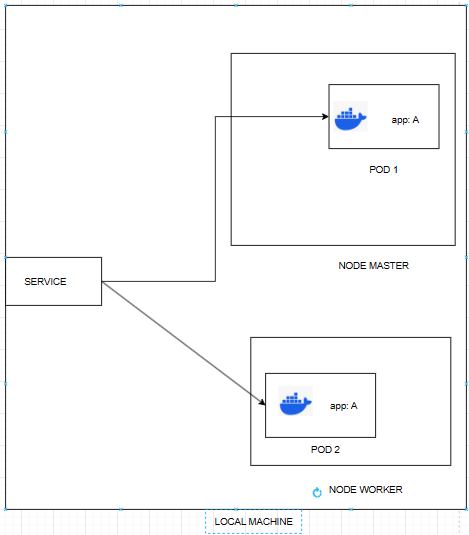